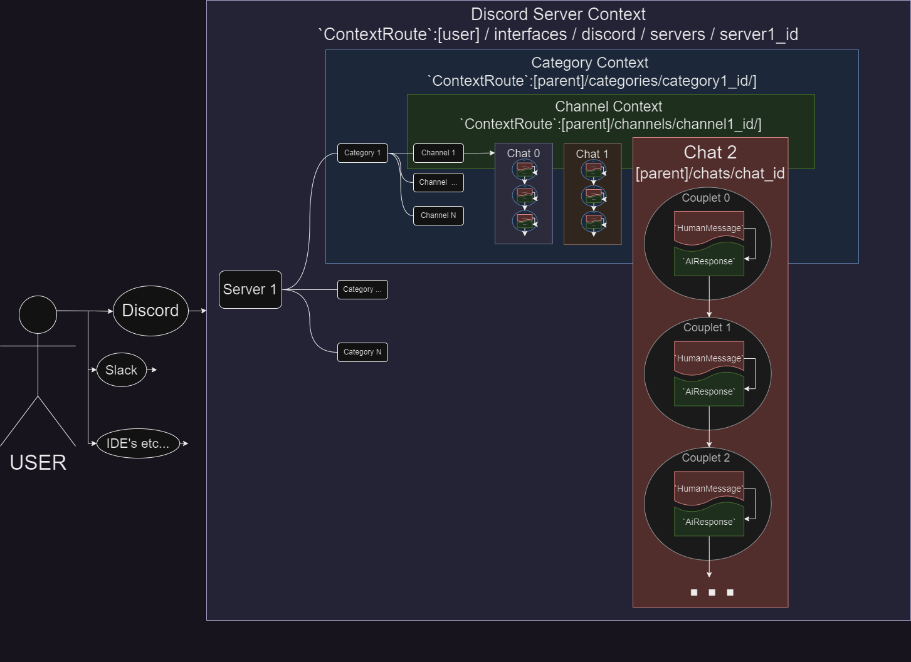

# ContextRoute✨

## Description

A context route defines the "location" where a conversation is taking place. 

The "root" of the context tree is the [User](User.md) themselves, and the leaves are the [Couplet](Couplet.md) that that User produced


This diagram shows the context route tree in the Discord interface. 

A given [Couplet](Couplet.md)'s route for a 'chat' that occurs in a thread would be: 

- User/
	- Interfaces/
		- Discord/
			- Servers/
				- server0_id/
					- Categories/
						- category0_id/
							- Channels/
								- channel0_id/
									- Threads/
										- thread0_id/
											- Couplets/
												- couplet0
													- HumanMessage
													- AiResponse


```ad-note
title: Note on Discord "channels" contexts

Discord has a screwy incestuous ontology - basically, everything (Channels, Threads, Forum Posts, DM's) is a 'Channel' but they act differently based ontheir subtype? 

It makes them annoying to work with (at least the way I've been using them)

Some notes: 

- A `Thread` is a `TextChannel` (i.e. like a standard, parent `TextChannel`)
- Direct Message (`DMChannel`?) 
	- DM's with the Bot and the User 
	- Discord treats this equivalent to a Server channel/thread, but has no Guild, i think?
	- Can be used to privately communicate with the User (e.g. through [[ChronJobs]]s)
- Forum Posts (`ForumChannel`)
	- Forum posts are treated like channels/threads
	- They can be treated MORE OR LESS interchangable with a standard `Thread`
		- but there is something strange about them? 
		- can't remember


```


