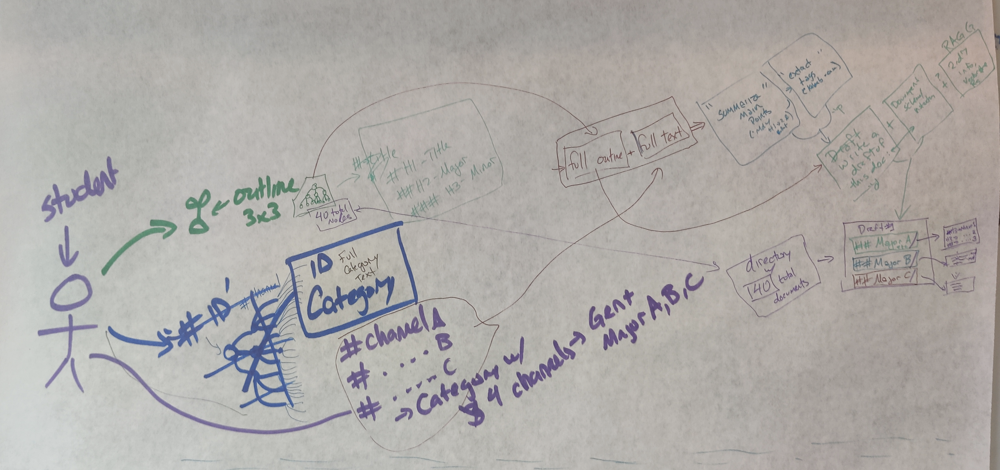
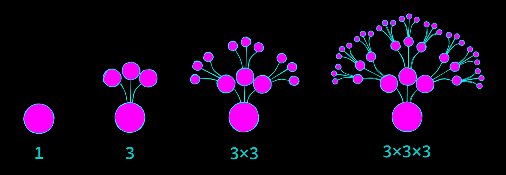

### Project Overview:

We are tasked with developing an analysis pipeline that processes student conversations and outlines from a Discord server to create a knowledge base. The knowledge base will consist of 40 documents for each student, structured around their provided 3x3 outline. The documents are generated by an AI-augmented pipeline, which summarizes conversations, extracts tags, and drafts structured markdown documents.

### Objectives:

1. Extract and structure conversation data from YAML files.
2. Parse and integrate students' [3x3 outlines](#3x3-outline-schema).
3. [Summarize conversation points](#extraction) and [extract relevant tags](#tag-extraction) using AI.
4. Generate 40 markdown documents per student based on their outline and conversation data.

### Processing Pipeline Stages:

#### Stage 0 - **Load Conversation Data**:
-  Build a `scraper` that will pull data from a Discord server and save it using the `ServerData` pydantic model 
   - Match SkellyBot data model 
     - ~~User{} > Server{} >~~ Category{`StudentID's`} > Channel{} > Chat{} > Couplet[] > (HumanMessage, AiResponse)
   - also:
     - pull messages tagged with :seedling: as the 'outline'
     - pull `bot-instructions` from each level

#### Stage 1 - AI Process Text Blobs
Process **Each Student Data Blob** + **Stuent Outline** with multi-stage AI pipline

A. **Summarization Task**: 
 The AI summarizes main points from conversations based on the 3x3 outline (format - `#H1, ##H2, -bullets`).
  - [[Summarization prompt]]
    - Include `course description` prompt blob? 
    - Keep it simple? 

B. **Tag Extraction Task**: 
 The AI extracts tags from conversations in kebab-case format.
 - [[Tag-extraction Prompt]]

#### Stage 2 - **Document Drafting**: 
- Using the AI-generated summaries and tags, along with the students' outlines:
  -  Iterate through each of the `40` nodes of the 3x3 outline to generate a Wikipedia-style `.md` document
  -  [[Document Drafting Prompt]]

___

## Considerations
### Data Management:

- Need implement basic data tracking to manage the flow of data through the pipeline stages.
  
- We will use Pydantic models to define and validate the data structure at each stage.

## Data models

### Pydantic Data Models:  
#### **ConversationModel**:
 Holds the structured conversation data extracted from the YAML file.
#### **OutlineModel**:
 Contains the student's provided 3x3 outline structure.
#### **SummaryModel**:
 Represents the summarized main points of the conversation.
#### **TagModel**:
 Stores the extracted tags from the conversation.
#### **DocumentModel**:
 Holds the structure for the final markdown documents, including summaries, tags, and any additional metadata.

- Considerations: 
  - similar to the `green check parser` from OG Classbot era
  - use `Field/Description` tag for prompty/description stuff
  - Spit errors back into bot's mouth
  - LLM Validate against `description` after Pydantic validations pass

___

### [??] Data/Processing tracking via SQLite- 
 - Set up SQLite for data tracking, error logging, and storing intermediate outputs.
  - might be overkill? 
  - ..but may also be a good op to gain some XP in this method, bc I think this is a pretty easy task for that kinda thing
  - Could also just use a `dict`...
#### **Database Schema**:
 Design a database schema that mirrors your Pydantic models and can track the progress of each student's data through the pipeline.
#### **Progress Tracking**:
 Include a status field in your database to indicate which stage the data is in (e.g., extracted, summarized, tagged, documented).
#### **Error Logging**:
 Have a table to log errors that occur at any stage, linked to the specific student's data entry for easy troubleshooting.
#### **Intermediate Storage**:
 Store intermediate outputs in the database as BLOBs or text fields, depending on their size and format.
#### **Utilities**:
 Create utility functions that interact with the database to insert, update, and retrieve data as it flows through the pipeline.

___
## TO DO:

1. **Database Schema Design**: Develop a schema that reflects the Pydantic models and the pipeline's flow.
2. **Error Logging**: Establish a mechanism to log and handle errors at each pipeline stage.
   1. e.g. spit errors back into bot's mouth
      1. error types:
         1. Syntactic - e.g. Pydantic Validation errors 
         2. Semantic - e.g. LLM comp w/ `description` text 

3. **Pipeline Development**: Implement the AI-augmented stages using Python and relevant libraries.
4. **Data Tracking System**: Build a system using SQLite to track the progress of each student's data.
5. **Testing and Quality Assurance**: Write unit tests for each stage and ensure the integrity of the data.

### Deliverables:

1. A functioning analysis pipeline that processes input data and generates the desired markdown documents.
2. A SQLite database that tracks data progress, logs errors, and stores intermediate outputs.
3. Documentation detailing the pipeline's structure, data models, and how to operate the system.

---
## Additional Info 

### 3x3 Outline Schema
"""
# Capstone Title
## Major Topic A
### Minor Topic 1
- citable-text-blob-i
- citable-text-blob-ii
- citable-text-blob-iii
## Major Topic B
- ...(same structure)
## Major Topic C
- ...

[40 total nodes:
- 1x root (full-tree)
- 3x Major Topic
- 9x Minor Topic
- 27x citable-text-blob
___
1+3+9+27 = 40 node -> 40 `.md` documents]
"""